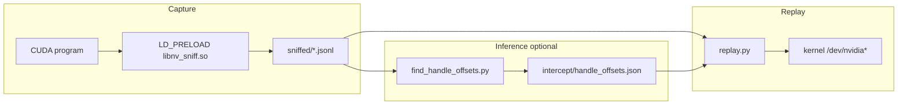
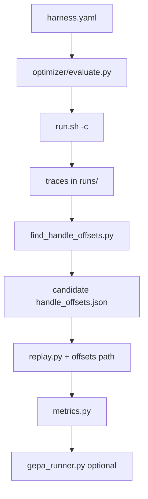

# Architecture — ioctl-cuda-mapping

## Current pipeline

## Optimizer layer (plan-v1)

Sits **beside** the pipeline: it does not change how capture or replay work.
It orchestrates repeated captures, writes candidate `handle_offsets.json`
under `optimizer/runs/<id>/`, replays with those candidates, and emits JSON
metrics (and optional GEPA optimization over harness YAML).

## Key files

| Path | Responsibility |
|------|------------------|
| `cuda-ioctl-map/intercept/nv_sniff.c` | Record ioctl buffers |
| `cuda-ioctl-map/replay/replay.py` | Re-issue ioctls with patching |
| `cuda-ioctl-map/tools/find_handle_offsets.py` | Pair traces → offset JSON |
| `cuda-ioctl-map/optimizer/evaluate.py` | Live evaluator + metrics export |
| `cuda-ioctl-map/optimizer/metrics.py` | Parse replay output, diff offsets |

## Data artifacts

- **Trace:** JSONL with `open` / `ioctl` lines (`before`/`after` hex).
- **Offsets:** JSON map keyed by `0xXXXXXXXX` ioctl request string.
