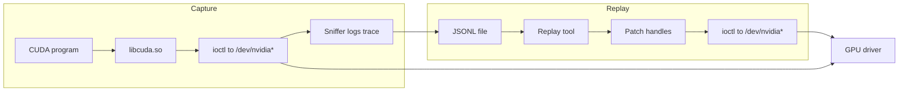

# CUDA → ioctl Mapping & Replay

Record every ioctl that `libcuda.so` sends to the NVIDIA kernel driver, then replay those ioctls **without** the CUDA library — proving we understand the driver protocol well enough to drive the GPU directly.



*We record every ioctl from a CUDA program, then replay the same ioctls without using CUDA—proving we understand the driver protocol.*

## Quick Start

```bash
cd cuda-ioctl-map

# End-to-end: compile a .cu file → capture its ioctls → replay them
bash run.sh programs/matmul.cu
```

That single command does three things:

1. **Compile** — `nvcc` builds the binary
2. **Capture** — runs the binary under `LD_PRELOAD` sniffer, writes a JSONL trace
3. **Replay** — reads the trace, re-opens the same devices, re-issues every ioctl with handle patching

Output looks like:
```
━━━ Compile ━━━
  → programs/matmul

━━━ Capture ━━━
matmul: all OK — C[i][j] == 128 for all i,j
  → sniffed/matmul.jsonl (834 lines, 781 ioctls)

━━━ Replay ━━━
DONE — 781/781 succeeded, 0 failed, 0 skipped
```

### Other ways to run

```bash
bash run.sh programs/matmul            # already compiled — capture + replay
bash run.sh sniffed/matmul.jsonl       # already captured — replay only
bash run.sh -v programs/matmul.cu      # verbose (DEBUG logging)
bash run.sh -c programs/matmul.cu      # capture only, skip replay
```

## How Replay Works

CUDA programs don't talk to the GPU directly. The user-space CUDA library (`libcuda.so`) communicates with the NVIDIA kernel driver through `ioctl()` system calls on device files like `/dev/nvidiactl`, `/dev/nvidia0`, and `/dev/nvidia-uvm`. Every CUDA API call — `cuInit`, `cuMemAlloc`, `cuLaunchKernel` — ultimately translates into a sequence of raw ioctls.

### Capture (sniffing)

An `LD_PRELOAD` library (`intercept/nv_sniff.c`) hooks the libc `open()` and `ioctl()` functions. For each ioctl to an NVIDIA device, it snapshots the argument buffer **before** and **after** the real call, then writes both as hex to a JSONL file:

```json
{"type":"open","seq":0,"path":"/dev/nvidiactl","ret":11}
{"type":"ioctl","seq":1,"fd":11,"req":"0xC00846D6","sz":8,"before":"0000008000000000","after":"0000008000000000","ret":0}
```

The CUDA program runs normally — the sniffer is invisible to it.

### Replay

`replay/replay.py` **bypasses libcuda entirely**. It doesn't call any CUDA functions. It directly:

1. **Opens the same device files** (`/dev/nvidiactl`, `/dev/nvidia0`, etc.)
2. **Sends the exact same ioctl bytes** to the kernel driver

The GPU kernel driver doesn't know or care whether the ioctls came from `libcuda.so` or from our replay tool — it processes them identically.

### Handle patching

The kernel driver assigns **opaque handle values** (like object IDs) when you create resources. These handles differ every run. Later ioctls reference those handles, so replay must **patch** captured handle values to the new live ones. `intercept/handle_offsets.json` tells the replay engine which byte offsets in each ioctl's buffer contain handles, and `replay/handle_map.py` does the remapping.

### In summary

```
Normal execution:
  Your code  →  libcuda.so  →  ioctl()  →  kernel driver  →  GPU

Capture:
  Your code  →  libcuda.so  →  [sniffer records before/after]  →  ioctl()  →  kernel driver  →  GPU

Replay:
  replay.py  →  ioctl()  →  kernel driver  →  GPU
  (no libcuda, no CUDA API — just raw ioctls with patched handles)
```

## Repository Structure

```
cuda-ioctl-map/
├── run.sh                 # Single entry point: compile → capture → replay
│
├── programs/              # CUDA test programs (.cu source + compiled binaries)
│   ├── cu_init.cu         #   cuInit only
│   ├── cu_device_get.cu   #   + cuDeviceGet
│   ├── cu_ctx_create.cu   #   + cuCtxCreate
│   ├── cu_mem_alloc.cu    #   + cuMemAlloc / cuMemFree
│   ├── cu_module_load.cu  #   + cuModuleLoadData (PTX JIT)
│   ├── cu_launch_null.cu  #   + cuLaunchKernel (no-op kernel)
│   ├── cu_memcpy.cu       #   + cuMemcpyDtoH
│   ├── vector_add.cu      #   + real kernel: C[i] = A[i] + B[i]
│   ├── matmul.cu          #   + 128×128 matrix multiply (target milestone)
│   └── Makefile
│
├── intercept/             # LD_PRELOAD ioctl sniffer
│   ├── nv_sniff.c         #   hooks open/ioctl, records before/after hex
│   ├── libnv_sniff.so     #   compiled shared library
│   ├── handle_offsets.json #  which byte offsets hold handles per ioctl code
│   ├── collect.sh         #   batch-capture all programs
│   └── Makefile
│
├── sniffed/               # Captured JSONL traces (one per program)
│   ├── cu_init.jsonl
│   ├── cu_device_get.jsonl
│   ├── cu_ctx_create.jsonl
│   ├── cu_mem_alloc.jsonl
│   ├── cu_module_load.jsonl
│   ├── cu_launch_null.jsonl
│   ├── cu_memcpy.jsonl
│   ├── vector_add.jsonl
│   └── matmul.jsonl
│
├── replay/                # Replay engines
│   ├── replay.py          #   Python replay (main tool)
│   ├── handle_map.py      #   FdMap, HandleMap, ReqSchema, load_schemas
│   ├── replay.c           #   C replay (reference implementation)
│   ├── handle_map.h       #   C handle map (header-only hash map)
│   └── Makefile
│
├── tools/                 # Utilities
│   ├── find_handle_offsets.py   # diff two captures to discover handle offsets
│   ├── collect_two_runs.sh      # capture two cu_init runs for offset discovery
│   ├── compare_snapshots.py     # compare driver state before/after replay
│   └── snapshot_driver_state.sh # dump /proc/driver/nvidia state
│
├── lookup/                # Static ioctl code → name mapping
│   └── ioctl_table.json
│
├── traces/                # Legacy strace logs
├── parsed/                # Parsed strace JSON
├── annotated/             # Annotated strace JSON
├── schema/                # Master mapping schema
├── baseline/              # Timestamped analysis snapshots
└── validation/            # Replay validation scripts
```

## Prerequisites

- Linux with NVIDIA GPU and driver installed
- CUDA toolkit (`nvcc`) — set `NVCC` env var if not at `/usr/local/cuda-12.5/bin/nvcc`
- Python 3.10+
- Access to `/dev/nvidia*` devices (world-readable on most setups; otherwise run as root)

## Test Programs (ladder)

Each program builds on the previous, progressively exercising more of the driver:

| Program | CUDA APIs | Ioctls | Replay |
|---------|-----------|--------|--------|
| `cu_init` | cuInit | 230 | ✅ 0 failed |
| `cu_device_get` | + cuDeviceGet | 230 | ✅ 0 failed |
| `cu_ctx_create` | + cuCtxCreate | 575 | ✅ 0 failed |
| `cu_mem_alloc` | + cuMemAlloc/Free | 781 | ✅ 0 failed |
| `cu_module_load` | + cuModuleLoadData (PTX) | 776 | ✅ 0 failed |
| `cu_launch_null` | + cuLaunchKernel | 776 | ✅ 0 failed |
| `cu_memcpy` | + cuMemcpyDtoH | 781 | ✅ 0 failed |
| `vector_add` | + real compute kernel | 781 | ✅ 0 failed |
| **matmul** | **+ 128×128 matrix multiply** | **781** | **✅ 0 failed** |

## Advanced Usage

### Discover handle offsets for a new ioctl

If replay fails on a new program, you likely need to update `intercept/handle_offsets.json` with the handle byte offsets for the failing ioctl code. Run the program twice and diff:

```bash
# Capture two independent runs
NV_SNIFF_LOG=sniffed/my_prog_a.jsonl LD_PRELOAD=./intercept/libnv_sniff.so ./programs/my_prog
NV_SNIFF_LOG=sniffed/my_prog_b.jsonl LD_PRELOAD=./intercept/libnv_sniff.so ./programs/my_prog

# Discover handle offsets by diffing the two runs
python3 tools/find_handle_offsets.py sniffed/my_prog_a.jsonl sniffed/my_prog_b.jsonl intercept/handle_offsets.json

# Now replay should work
bash run.sh sniffed/my_prog.jsonl
```

### Use the C replay instead

```bash
make -C replay
./replay/replay sniffed/matmul.jsonl
```
