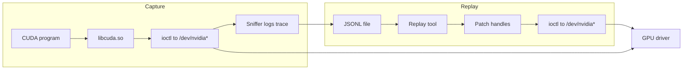
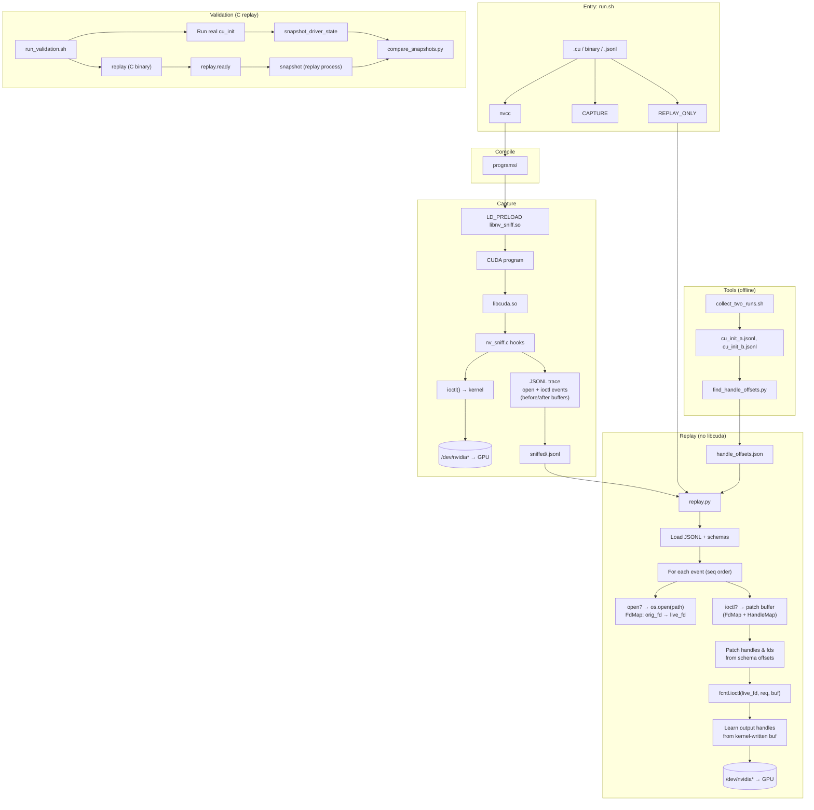

# Code Review — cuda-ioctl-map

*High level: we record every ioctl from a CUDA program, then replay the same ioctls without using CUDA—proving we understand the driver protocol.*

---

**How it works:** `run.sh` compiles a CUDA program, runs it under an LD_PRELOAD sniffer that logs every open/ioctl on `/dev/nvidia*` to a JSONL file. Replay reads that JSONL, re-opens the same devices, and re-issues each ioctl with **handle/fd patching** (captured values → live values via `handle_offsets.json`). The kernel driver sees identical ioctl traffic; no libcuda is used during replay. Validation runs the C replay and compares driver state snapshots. Handle offsets for new ioctls are discovered by diffing two captures (`find_handle_offsets.py`).

---

Phased L6-style systems code review. One phase at a time; approval required before the next.

---

## Phase 1: Repo overview

### 1. Overall purpose

**cuda-ioctl-map** reverse-engineers the NVIDIA kernel driver protocol by **capturing** every ioctl that `libcuda.so` issues (via an LD_PRELOAD sniffer) and **replaying** those ioctls **without** the CUDA library — proving the driver protocol can be driven directly. Goals: document the ioctl sequence, map handles/fds, and validate that replay produces equivalent GPU/driver state.

### 2. Directory structure and ownership

| Path | Owns |
|------|------|
| **`run.sh`** | Single entry point: compile (.cu → binary), capture (LD_PRELOAD sniffer → JSONL), replay (Python replay.py). Options: `-v` verbose, `-c` capture-only, `-r` replay-only. |
| **`programs/`** | CUDA test programs (cu_init, cu_device_get, cu_ctx_create, cu_mem_alloc, cu_module_load, cu_launch_null, cu_memcpy, vector_add, matmul). Makefile + nvcc. Ladder of increasing API surface. |
| **`intercept/`** | Sniffer: `nv_sniff.c` (LD_PRELOAD hook of open/openat/close/ioctl on `/dev/nvidia*`), writes JSONL to `$NV_SNIFF_LOG`. `handle_offsets.json` = per-ioctl-code handle/fd byte offsets for replay. `collect.sh` batch-captures. Makefile builds `libnv_sniff.so`. |
| **`sniffed/`** | Captured JSONL traces (one per program); produced by run.sh or collect.sh. |
| **`replay/`** | Replay engines: **replay.py** (main: reads JSONL, opens devices, patches handles via handle_map.py, issues ioctls); **replay.c** (C reference); **handle_map.py** (FdMap, HandleMap, ReqSchema, load_schemas); **handle_map.h** (C handle map). Makefile for C replay. |
| **`tools/`** | `find_handle_offsets.py` (diff two captures → discover handle offsets), `collect_two_runs.sh`, `compare_snapshots.py`, `snapshot_driver_state.sh`. |
| **`lookup/`** | `ioctl_table.json` — static ioctl code → name/description (used by annotate_static.py, not by replay). |
| **`parsed/`** | Parsed strace-style JSON (output of parse_trace.py). |
| **`annotated/`** | Annotated parsed JSON (annotate_static.py). |
| **`schema/`** | `master_mapping.json` — mapping schema (build_schema.py). |
| **`baseline/`** | Timestamped snapshots of analysis (parsed, annotated, schema, metrics). |
| **`validation/`** | `run_validation.sh`: run real cu_init, snapshot driver; run **C** replay, snapshot; compare snapshots. Depends on `replay.ready` sentinel from replay.c. |

**Structurally odd / notable:**

- **Two replay implementations**: Python (`replay/replay.py`) is the primary path from `run.sh`; C (`replay/replay.c`) is used by `validation/run_validation.sh` and writes `replay.ready` in project root. Behavior and handle logic must stay in sync; no shared spec beyond handle_offsets.json.
- **Legacy strace pipeline**: `parse_trace.py`, `annotate_static.py`, `build_schema.py`, `generate_report.py` operate on strace-derived input and populate `parsed/`, `annotated/`, `schema/`, `baseline/`. The main capture path is now the sniffer (JSONL), not strace. Relationship between “strace pipeline” and “sniffer + replay” is not documented in-repo; new contributors may be unsure which path is canonical.
- **README lives one level up**: Primary README is `ioctl-cuda-mapping/README.md`; `cuda-ioctl-map/` has no README. Run instructions say “Run from the cuda-ioctl-map/ directory” — correct but easy to miss if opening the repo at `ioctl-cuda-mapping/`.
- **Validation assumes C replay**: `run_validation.sh` invokes `replay/replay` (C binary) and polls `replay.ready`; it does not use `replay.py`. So “replay correctness” in validation is C-replay-only unless a separate Python validation is added.

### 3. Entry points

| Entry point | How | Notes |
|-------------|-----|--------|
| **run.sh** | `bash run.sh <file.cu \| binary \| capture.jsonl>` | Compile (if .cu), capture (if not replay-only), replay (if not capture-only). All from `cuda-ioctl-map/`. |
| **replay/replay.py** | `python3 replay/replay.py [-v] <capture.jsonl>` | Called by run.sh. Uses `intercept/handle_offsets.json` by default (path logic in replay.py). |
| **replay/replay** (C) | `./replay/replay <capture.jsonl> [handle_offsets.json]` | Used by validation/run_validation.sh; writes `replay.ready` in CWD. |
| **intercept/collect.sh** | From `cuda-ioctl-map/`: batch capture of programs. | Produces sniffed/*.jsonl. |
| **validation/run_validation.sh** | From `cuda-ioctl-map/`: real run + C replay + snapshot diff. | Depends on C replay binary and replay.ready. |
| **parse_trace.py / annotate_static.py / build_schema.py / generate_report.py** | Strace-based analysis pipeline. | Input: strace output; output: parsed/, annotated/, schema/, reports. Separate from sniffer/replay flow. |

### 4. Key data structures / objects flowing through the system

- **JSONL capture** (sniffer output): Lines are JSON objects. `type`: `"open"` (path, ret fd) or `"ioctl"` (fd, req hex, sz, before/after hex buffers, ret). `seq` for order. Replay uses `before` and re-opens devices to get live fds.
- **handle_offsets.json**: Keys = ioctl request codes (hex strings). Per entry: `handle_offsets` (input buffer offsets), `output_handle_offset` (where new handle is written), `fd_offsets` (offsets of fd values). Drives FdMap/HandleMap patching in replay.
- **FdMap** (handle_map.py): captured fd → live fd. Updated on open events; used to patch fd fields and to resolve which live fd receives each ioctl.
- **HandleMap** (handle_map.py): captured RM handle → live RM handle. Updated when an ioctl returns a new handle (output_handle_offset); used to patch input handle slots in later ioctls.
- **ReqSchema**: input_handle_offsets, output_handle_offset, fd_offsets. Parsed from handle_offsets.json per request code.
- **C replay**: Same logical flow (fd map, handle map, patch then ioctl); implementation in C with handle_map.h.

### 5. Architectural patterns

- **Capture–replay pipeline**: Capture (sniffer) → JSONL → Replay (Python or C) with handle/fd remapping. No feedback from replay into capture; single-pass replay in event order.
- **Handle/fd mapping**: Open events establish fd mapping; ioctls that return new handles (output_handle_offset) establish handle mapping; before each ioctl, buffer is patched (handles and fds) then submitted. Order of events is critical.
- **Dual replay**: Python (primary, used by run.sh) and C (validation, reference). Shared config: handle_offsets.json. No automated check that both produce identical behavior.
- **Legacy analysis pipeline**: Strace → parse_trace → parsed JSON → annotate_static (ioctl_table) → build_schema / generate_report → baseline. Parallel to sniffer/replay; no integration point documented.

---

---

## Phase 2: File-by-file

### run.sh

- **Responsibility:** Single entry point: decide compile/capture/replay from argument; run pipeline; report line/ioctl counts.
- **Inputs:** CLI args (optional `-v`/`-c`/`-r`, one of: `.cu`, binary path, `.jsonl`). Env: `NVCC`, `NVCCFLAGS`.
- **Outputs:** Compiled binary in `programs/`, capture in `sniffed/<name>.jsonl`, replay via stdout/exit.
- **Logic:** Branches on `*.jsonl` → replay-only; `*.cu` → compile then capture+replay; else treat as binary → capture+replay. Capture step runs binary with `NV_SNIFF_LOG` and `LD_PRELOAD`; exit code is from Python replay (not from capture). **Issue:** Capture uses `2>/dev/null || true`, so binary failure (e.g. no GPU, CUDA error) is hidden; replay may run on an empty or truncated capture. No check that `CAPTURE` exists or has ioctl events before replay when `REPLAY_ONLY=true` and user passes a path.

---

### replay/replay.py

- **Responsibility:** Read JSONL capture, re-open devices in order, patch handles/fds per schema, issue ioctls; report success/fail/skip and exit 0/1.
- **Inputs:** `capture` (Path), optional `offsets` (Path). Default offsets = `capture.parent / ".." / "intercept" / "handle_offsets.json"`.
- **Outputs:** stdout (per-event and summary), exit 0 if no failed ioctls else 1.
- **Key functions:** `load_jsonl` (hard exit on JSON error), `do_ioctl` (fcntl wrapper, returns 0 or -errno), `replay()` (main loop: open/close/ioctl; fd_map, handle_map; learn_output after successful ioctl).
- **Match name/architecture:** Yes; main Python replay engine.
- **Issues:** (1) Default offsets path assumes capture lives under project (e.g. `sniffed/foo.jsonl`). If user passes e.g. `/tmp/capture.jsonl`, default becomes `/intercept/handle_offsets.json` — wrong; should document or require explicit offsets for non-project captures. (2) Failed open in capture (ret &lt; 0): replay tries open anyway; if it succeeds, closes fd and prints "expected failure but succeeded" — correct. (3) `learn_output` uses captured "after" and live buffer; if ioctl fails, we don’t learn (live buffer may be partially written) — correct. (4) Close events: live_fd can be -1 (e.g. orig_fd never mapped); we try `os.close(live_fd)` only when live_fd >= 0; but we don’t remove orig_fd from fd_map, so a later ioctl with that orig_fd would still get -1 and be skipped — consistent.

---

### replay/handle_map.py

- **Responsibility:** FdMap (captured fd → live fd), ReqSchema (handle/fd offsets per ioctl code), HandleMap (captured RM handle → live), load_schemas from JSON.
- **Inputs:** handle_offsets.json (Path). Callers pass buffers and schemas.
- **Outputs:** Patched buffers (in-place), learned mappings.
- **Key:** `FdMap.learn_open`, `get`, `patch_fds`; `HandleMap.learn`, `learn_output` (from captured "after" + live buffer at output_handle_offset), `patch_input`; `load_schemas` returns {} if file missing (no error).
- **Match:** Yes.
- **Issues:** (1) Handle/fd width fixed at 4 bytes (`_HANDLE_SZ`); if any future ioctl used 8-byte handles, would be wrong. (2) `patch_input` and `patch_fds` skip offsets that would read past buffer end but do not warn; unknown handles log WARNING and pass through — could hide schema bugs. (3) `learn_output`: if captured_after_hex is shorter than output_handle_offset+4, we return without learning; same if live_buf too short — correct.

---

### intercept/nv_sniff.c

- **Responsibility:** LD_PRELOAD library that hooks open, open64, openat, openat64, close, ioctl; for `/dev/nvidia*` only, log open (path, ret) and ioctl (fd, dev, req, sz, before/after hex, ret) to $NV_SNIFF_LOG (JSONL).
- **Inputs:** Real libc calls from process; env `NV_SNIFF_LOG` (file path).
- **Outputs:** One JSON object per line to the opened file; fflush after each write.
- **Key:** Constructor resolves real_* via dlsym(RTLD_NEXT); open/openat track fd→path and log; close untracks; ioctl for nvidia fds: snapshot arg (sz from _IOC_SIZE, else MAX_CAPTURE_SZ 4096), real_ioctl, snapshot again, hex encode, write.
- **Match:** Yes; sniffer for nvidia devices.
- **Issues:** (1) open/openat: only `path` checked for `/dev/nvidia`; relative path like `nvidia0` wouldn’t be detected. (2) ioctl: when arg is NULL, before/after are zeroed (sz bytes); kernel may not expect NULL — pass-through is correct but log is misleading for size. (3) MAX_FDS 4096: if process has &gt;4096 nvidia fds open, fd tracking overflows (unlikely). (4) No close event logged — replay.py handles "close" events but sniffer doesn’t emit them; so replay never sees close. Checking: replay.c does have close handling? No — replay.c doesn’t handle "close" in the JSONL; only open and ioctl. So capture doesn’t emit close, and C replay doesn’t process it. Python replay does process close (os.close). So Python replay closes fds when capture has close events; but nv_sniff.c doesn’t log close. So capture from nv_sniff has no "type":"close" lines. So the Python close branch is dead for current sniffer output. If someone added close logging later, Python would close; C wouldn’t. Flag as inconsistency.

---

### replay/replay.c

- **Responsibility:** Same as replay.py: read JSONL, open devices, patch handles/fds, issue ioctls; write `replay.ready` when done (for validation script).
- **Inputs:** argv[1]=capture path, argv[2]=optional handle_offsets path. Default offsets = capture_dir/../intercept/handle_offsets.json. Sentinel path = realpath(capture_dir/..)/replay.ready.
- **Outputs:** stdout, exit 0/1, replay.ready file at project root (when realpath succeeds).
- **Key:** Minimal JSON parsing (strstr/json_str/json_long/json_u32hex/json_hexbuf); load_schemas (hand-rolled parser for "0x...", handle_offsets, output_handle_offset, fd_offsets); main loop open/ioctl only (no close handling); patch then ioctl; learn output handle from after_buf vs work.
- **Match:** Yes; C replay reference.
- **Issues:** (1) No "close" record handling — consistent with sniffer not emitting close; but Python replay has close handling, so behavior differs if close is ever added to capture. (2) LINE_BUF_SZ 128K: if a single JSON line is longer (e.g. huge UVM buffer), fgets truncates and parsing can fail or mis-attribute. (3) load_schemas: req==0 skipped; strtoul("0x...",0) can return 0 for malformed input — could drop a valid code. (4) find_schema: linear scan; MAX_SCHEMAS 128 — if handle_offsets.json has &gt;128 codes, later ones ignored. (5) Sentinel: validation expects replay.ready in ROOT_DIR; C replay writes to realpath(capture_dir/..)/replay.ready; when run_validation.sh passes sniffed/cu_init.jsonl, ROOT_DIR is cuda-ioctl-map, so they match.

---

### replay/handle_map.h

- **Responsibility:** Open-addressed hash map uint32→uint32 (HM_CAPACITY 4096), for RM handle remapping; sentinel 0xFFFFFFFF; 0 never stored.
- **Inputs/outputs:** hm_init, hm_put, hm_get, hm_dump; used by replay.c.
- **Match:** Yes.
- **Issues:** (1) Table full: hm_put returns 0 and prints to stderr; replay.c doesn’t check return — put failure is silent for exit path. (2) HM_SENTINEL in keys: if a real handle were 0xFFFFFFFF, would be treated as empty — doc says it must never appear.

---

### intercept/collect.sh

- **Responsibility:** Build libnv_sniff.so, run cu_init, cu_device_get, cu_ctx_create, cu_ctx_destroy under sniffer; write sniffed/*.jsonl.
- **Inputs:** None (assumes programs/ binaries exist and ROOT_DIR layout).
- **Outputs:** sniffed/cu_init.jsonl, etc.
- **Issue:** Only four programs; run.sh and README mention more (cu_mem_alloc, matmul, etc.). collect.sh is a subset; no warning if programs/ binary missing (run will fail with no clear message).

---

### validation/run_validation.sh

- **Responsibility:** Run real cu_init, snapshot; run C replay in background, wait for replay.ready, snapshot replay process; compare snapshots; clean replay.ready.
- **Inputs:** Optional capture (default sniffed/cu_init.jsonl), optional offsets. ROOT_DIR = validation/..
- **Outputs:** snapshot_real.txt, snapshot_replay.txt, comparison via compare_snapshots.py.
- **Issue:** Polls for `$ROOT_DIR/replay.ready` (100×0.1s). C replay writes to realpath(capture_dir/..)/replay.ready; if capture is absolute path outside repo, replay.ready may be elsewhere and script times out. When invoked as documented (from cuda-ioctl-map with default capture), ROOT_DIR and sentinel match.

---

### tools/find_handle_offsets.py

- **Responsibility:** Diff two JSONL captures (nvidiactl ioctls only); find 4-byte-aligned slots that differ and are non-zero (input handle candidates); find 0→non-zero in "after" (output handle); write handle_offsets.json. Excludes UVM; pointer filter (0x00007e00–0x7fff high word). Merges KNOWN_FD_OFFSETS.
- **Inputs:** run_a.jsonl, run_b.jsonl, optional output path.
- **Outputs:** handle_offsets.json (or third arg).
- **Issues:** (1) Pairing by position: if len(recs_a) != len(recs_b), uses min and warns; one run longer → tail ignored, can mis-attribute. (2) NVIDIACTL_ONLY: only /dev/nvidiactl; ioctls on /dev/nvidia0 etc. excluded — may miss handle-bearing ioctls on other devices. (3) output_off: uses "after" from run A only (after_a); if A and B differ in "after", output detection is one-sided. (4) KNOWN_FD_OFFSETS: 0xC00446C9 hardcoded; adding new fd ioctls requires code change.

---

### tools/compare_snapshots.py

- **Responsibility:** Load two snapshot files, normalise (strip hex, UUID, PID, timestamps, hardware telemetry lines), unified diff; exit 0 = PASS, 1 = FAIL.
- **Inputs:** real.txt, replay.txt (paths).
- **Outputs:** Exit code; prints PASS/FAIL and diff.
- **Issue:** Normalisation is heuristic; new driver output format (e.g. new hex fields) might not be stripped and could cause false FAIL or mask real differences.

---

### tools/snapshot_driver_state.sh

- **Responsibility:** Dump nvidia-smi -q, /proc/driver/nvidia/gpus/*/information, params; optionally count nvidia fds for a PID.
- **Inputs:** output file, optional PID.
- **Outputs:** Single file.
- **Issue:** nvidia-smi and proc paths may differ or be unreadable; script continues and writes "(unreadable)" — comparison may still fail or be noisy.

---

### tools/collect_two_runs.sh

- **Responsibility:** Build sniffer, run cu_init twice → sniffed/cu_init_a.jsonl, sniffed/cu_init_b.jsonl; warn if line counts differ.
- **Inputs:** None.
- **Outputs:** Two JSONL files.
- **Match:** Yes; used for handle offset discovery.

---

### programs/Makefile, programs/cu_init.cu

- **Makefile:** Builds TARGETS (cu_init … matmul) from .cu with nvcc; NVCC default /usr/local/cuda-12.5/bin/nvcc. **Issue:** NVCC in run.sh is same path; if user sets NVCC only for run.sh, make may use different one.
- **cu_init.cu:** Calls cuInit(0), prints OK or FAIL. Minimal; representative of ladder. Other programs (cu_ctx_create, matmul, etc.) follow same pattern (more API calls).

---

### parse_trace.py

- **Responsibility:** Parse strace-style log (openat/close/ioctl lines); maintain FD→device in order; output parsed JSON (ioctl_sequence, fd_map); mark "is_new" vs previous step. Exposed parse_lines() for reuse (e.g. check_reproducibility).
- **Inputs:** Log path(s); optional prev_parsed path for delta.
- **Outputs:** parsed/<step>.json per log; prints total/unique/new.
- **Match:** Strace pipeline; not sniffer. **Issue:** Expects _IOC(...) or raw hex ioctl lines; sniffer JSONL is different format — parse_trace is not used for sniffer output. (2) Out path: out_dir = dirname(dirname(log_path))/parsed — assumes log in a subdir (e.g. traces/foo.log); fragile if run from elsewhere.

---

### annotate_static.py

- **Responsibility:** Load lookup/ioctl_table.json; for each parsed JSON, attach annotation (name, description, confidence, needs_review) to each ioctl; write annotated/<name>.json; flag unknown and low-confidence.
- **Inputs:** Parsed JSON path(s). LOOKUP loaded at module load from BASE/lookup/ioctl_table.json.
- **Outputs:** annotated/*.json; prints known/unknown/low_conf.
- **Issue:** BASE = dirname(__file__) — assumes script run from repo root or that lookup is next to script; if run from another cwd, BASE is still script dir, so lookup path is correct. (2) out_dir = dirname(dirname(parsed_path))/annotated — assumes parsed_path like .../parsed/foo.json; breaks if path structure differs.

---

### build_schema.py

- **Responsibility:** Aggregate annotated/*.json into schema/master_mapping.json; STEP_ORDER for cumulative deltas; per-step new_codes, event_delta, confidence_summary; merge parsed/<step>_repro_report.json if present.
- **Inputs:** Reads annotated/*.json, parsed/*_repro_report.json (optional). STEP_ORDER has cu_memcpy_htod, cu_launch_kernel, etc. — names don’t match program names (cu_memcpy, cu_launch_null). all_f keys from annotated basename without .json.
- **Outputs:** schema/master_mapping.json.
- **Issue:** STEP_ORDER and actual annotated filenames must align; if annotated has cu_ctx_destroy but STEP_ORDER has cu_ctx_destroy, ok; but cu_memcpy_htod vs cu_memcpy — mismatch possible. B2 warning when predecessor step missing.

---

### generate_report.py

- **Responsibility:** Read schema/master_mapping.json; emit CUDA_IOCTL_MAP.md with tables (properties, confidence, new ioctls, event delta, frequency-unstable). Escapes markdown in cells.
- **Inputs:** BASE/schema/master_mapping.json.
- **Outputs:** CUDA_IOCTL_MAP.md.
- **Issue:** Depends on master_mapping structure; if build_schema or repro report format changes, can break or show wrong data.

---

### intercept/Makefile

- **Responsibility:** Build libnv_sniff.so from nv_sniff.c with -fPIC -shared -ldl.
- **Match:** Yes.

---

---

## Phase 3: Cross-cutting issues

### 1. Inconsistencies between files

- **Close events:** Sniffer never emits `"type":"close"`. Python replay handles close (closes live fd); C replay ignores close. So today both replays behave the same (no close in trace). If close logging is ever added to nv_sniff.c, Python will close fds and C will not — replay results could diverge (fd leak on C side, or wrong fd used later).
- **Offsets path when capture is outside repo:** replay.py defaults to `capture.parent/../intercept/handle_offsets.json`; replay.c uses `capture_dir/../intercept/handle_offsets.json`. Both assume capture lives one level below project root (e.g. sniffed/). If user passes an absolute path like `/tmp/out.jsonl`, Python resolves to `/intercept/handle_offsets.json`, C to `/tmp/../intercept/...` — both wrong and neither documents the assumption.
- **Validation vs main path:** run.sh always uses **Python** replay; run_validation.sh always uses **C** replay and polls replay.ready. There is no guarantee that Python and C replay produce the same ioctl outcomes or driver state; validation does not exercise the same code path as the primary pipeline.
- **NVCC:** run.sh and programs/Makefile both default to `/usr/local/cuda-12.5/bin/nvcc`. If a user sets NVCC only in the environment for run.sh, make inside run.sh (for intercept) doesn’t run programs/Makefile; but a manual `make -C programs` would use a different NVCC unless exported. Inconsistent if only one of the two is overridden.
- **Strace vs sniffer formats:** parse_trace.py and the rest of the strace pipeline expect strace text lines. The sniffer produces JSONL. The two worlds share lookup/ioctl_table.json (names) but not handle_offsets (replay); handle_offsets is sniffer/replay-only. No single doc states which pipeline is canonical for “CUDA → ioctl map.”

---

### 2. Missing pieces

- **No spec for replay behavior:** handle_offsets.json is the only shared contract between Python and C replay. Order of operations (patch input handles, then fd, then ioctl, then learn output) is duplicated in both; a bug in one (e.g. patch order, or when to learn) is easy to introduce in the other. A short “Replay algorithm” section in a doc or comment would reduce drift.
- **No check that capture succeeded before replay:** run.sh runs the binary with `2>/dev/null || true` and then always runs replay if not capture-only. If the program crashes or exits with error, the JSONL may be empty or truncated; replay still runs and may report 0/x succeeded (empty) or fail in a way that doesn’t point back to “capture failed.”
- **Validation only for C replay:** There is no automated “run Python replay, snapshot, compare” path. A new engineer might assume run_validation.sh validates the same replay that run.sh uses; it doesn’t.
- **No regression test for Python vs C replay:** Even a simple “same capture, both replays, same exit code and same success count” would catch schema or logic drift between the two.
- **collect.sh vs full ladder:** collect.sh only runs four programs (cu_init through cu_ctx_destroy). run.sh and the README ladder include cu_mem_alloc, cu_module_load, matmul, etc. There is no single “capture everything” script that aligns with the documented ladder, and no check that required programs exist before capture.

---

### 3. Single most likely place for a bug or failure

**run.sh capture step:** The pipeline runs the target binary with the sniffer and ignores its exit code (`|| true`). If the program fails (no GPU, wrong driver, CUDA error, OOM), the capture file can be empty or truncated. Replay then runs against that file: either “0 ioctls” with a misleading “DONE — 0/0 succeeded” or a partial trace that fails partway through with handle/fd mismatches. The failure mode (replay errors or skip/fail counts) does not point to “the captured program didn’t run correctly.” Adding a check that the capture has at least one ioctl (or that the binary exited 0 when not replay-only) would make the most likely operational failure (bad or missing capture) visible instead of silent.

---

### 4. What to warn a new engineer about

- **Always run from cuda-ioctl-map/.** run.sh, validation, and collect scripts assume CWD or paths relative to project root. Running from intercept/ or from the parent repo root will break paths (sniffed/, replay.ready, handle_offsets.json).
- **Two replays, one validation.** The script that “validates” replay is run_validation.sh and it uses the **C** binary. The script you use every day (run.sh) uses **Python** replay. Don’t assume “validation passed” means the Python path is validated.
- **handle_offsets.json is critical and easy to get wrong.** Missing or wrong offsets cause “unknown handle” warnings and failed ioctls. When adding a new program or driver version, re-run find_handle_offsets (or equivalent) and sanity-check that replay still gets 0 failed.
- **Strace pipeline is separate.** parsed/, annotated/, schema/, generate_report, and CUDA_IOCTL_MAP.md come from **strace** and a different pipeline. The sniffer + replay path does not feed into those. Don’t mix the two when debugging “why doesn’t my replay match?” — they consume different inputs.
- **Capture failures are hidden.** If a CUDA program fails under the sniffer, run.sh still continues to replay. Check the capture file size or line count after a run, and consider failing the script if the binary exited non-zero (when not replay-only).

---

**Phase 3 complete. Review is complete.**
