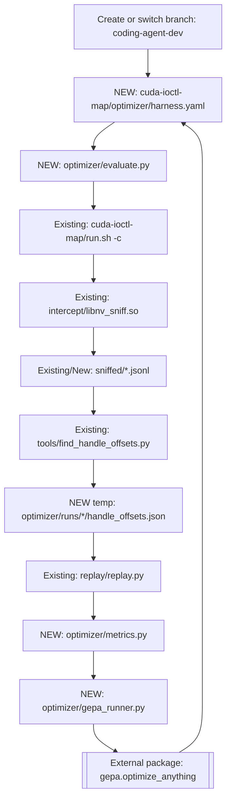

# GEPA Optimizer Harness Plan

## Overview

Implement the roadmap's Phase 2.5 plus real GEPA integration on a new
`coding-agent-dev` branch. The first slice will add a live evaluator harness
around the existing CUDA capture, handle-offset inference, and replay commands,
then expose that evaluator to GEPA's `optimize_anything` loop.

## Execution Flow

## Implementation Scope

- Work on `coding-agent-dev`; first step during implementation is to create or
  switch to that branch without touching unrelated work.
- Place the new implementation under
  [`cuda-ioctl-map/optimizer`](cuda-ioctl-map/optimizer) because existing
  commands in [`cuda-ioctl-map/run.sh`](cuda-ioctl-map/run.sh) assume
  `cuda-ioctl-map/` as their working directory.
- Add real GEPA integration, but keep the deterministic evaluator usable on its
  own. This prevents the GEPA loop from being the only way to validate the
  harness.

## New Files

- [`cuda-ioctl-map/optimizer/harness.yaml`](cuda-ioctl-map/optimizer/harness.yaml)
  defines programs, repeated capture count, baseline offsets path, candidate
  run directory, replay verbosity, and scoring weights.
- [`cuda-ioctl-map/optimizer/evaluate.py`](cuda-ioctl-map/optimizer/evaluate.py)
  runs the live pipeline: capture N traces, infer candidate offsets, replay
  traces with the candidate offsets, and emit structured JSON metrics plus ASI
  diagnostics.
- [`cuda-ioctl-map/optimizer/metrics.py`](cuda-ioctl-map/optimizer/metrics.py)
  parses replay summaries, compares candidate offsets to
  [`cuda-ioctl-map/intercept/handle_offsets.json`](cuda-ioctl-map/intercept/handle_offsets.json),
  computes coverage/agreement/replay scores, and formats GEPA side information.
- [`cuda-ioctl-map/optimizer/gepa_runner.py`](cuda-ioctl-map/optimizer/gepa_runner.py)
  calls `gepa.optimize_anything` with the evaluator, seeded by `harness.yaml` or
  a small text candidate describing thresholds/corpus schedule.
- [`cuda-ioctl-map/optimizer/requirements.txt`](cuda-ioctl-map/optimizer/requirements.txt)
  records Python dependencies, including `gepa` and YAML parsing if the repo
  lacks an existing dependency file.
- [`cuda-ioctl-map/optimizer/README.md`](cuda-ioctl-map/optimizer/README.md)
  documents live prerequisites, commands, expected outputs, and how to run a
  bounded GEPA optimization.

## Existing Code Reused

- [`cuda-ioctl-map/run.sh`](cuda-ioctl-map/run.sh) already supports capture-only
  with `-c` and replay-only by passing a `.jsonl`; the evaluator should call it
  as a subprocess from `cuda-ioctl-map/`.
- [`cuda-ioctl-map/tools/find_handle_offsets.py`](cuda-ioctl-map/tools/find_handle_offsets.py)
  already writes a handle-offset JSON from two traces. The first implementation
  should wrap this script rather than refactor it.
- [`cuda-ioctl-map/replay/replay.py`](cuda-ioctl-map/replay/replay.py) already
  accepts an optional offsets path, so evaluator runs can replay with candidate
  offsets isolated under `optimizer/runs/`.

## Scoring Contract

- Primary hard gate: replay failure count must be zero for every selected live
  trace.
- Metrics to report: replay success ratio, failed count, skipped count,
  candidate-vs-baseline handle-offset agreement, discovered ioctl count, field
  coverage, and inference warnings.
- ASI to GEPA: failed ioctl sequence/request/errno, replay summary, offset diff
  against baseline, low-coverage ioctl codes, and command stderr snippets.
- Keep generated candidate artifacts in per-run directories under
  `cuda-ioctl-map/optimizer/runs/`, and avoid overwriting the checked-in
  `intercept/handle_offsets.json`.

## Validation Plan

- Live smoke 1: run the deterministic evaluator on the smallest CUDA ladder
  pair available, likely `programs/cu_init.cu` or the nearest existing program
  pair, and confirm it captures two traces, writes candidate offsets, and
  replays with zero failures.
- Live smoke 2: run evaluator on a larger program such as
  `programs/cu_mem_alloc.cu` or `programs/vector_add.cu` to verify metrics scale
  beyond init-only traces.
- GEPA smoke: run `gepa_runner.py` with a tiny metric-call budget and one or two
  programs to confirm `optimize_anything` can call the evaluator, receive
  scores/ASI, and persist a best candidate.
- Regression guard: compare baseline replay using the checked-in offsets versus
  candidate replay and fail the evaluator if candidate replay regresses.

## Risks And Gaps

- Live replay requires NVIDIA device access and sufficient privileges. The
  implementation should fail early with clear diagnostics if `replay.py` hits
  the existing root/CAP_SYS_ADMIN error.
- `run.sh` suppresses program stderr and ignores program failure during capture.
  The evaluator should detect missing or empty captures and treat them as hard
  failures.
- `replay.py` exits successfully when skipped ioctls are nonzero but failed
  ioctls are zero. Metrics must parse the `DONE` summary and score skips as a
  regression.
- `find_handle_offsets.py` currently compares two aligned traces and is
  NVIDIA-control-device oriented. The first GEPA candidate space should tune
  corpus schedule and thresholds conservatively, not assume full
  device-agnostic spec inference yet.
- There is no existing Python packaging file in this repo. Keep dependency
  installation local to `optimizer/requirements.txt` unless broader packaging
  becomes necessary.

## Implementation Todos

- Create or switch to `coding-agent-dev`, inspect working tree, and avoid mixing
  unrelated changes.
- Add `optimizer/harness.yaml`, `evaluate.py`, and run-directory conventions for
  live capture, inference, replay, and JSON metrics.
- Implement metrics parsing, baseline offset comparison, replay regression
  gates, and ASI formatting.
- Add GEPA dependency instructions and `gepa_runner.py` around
  `optimize_anything` with a bounded smoke configuration.
- Document live prerequisites and run live smoke validations on small and larger
  CUDA programs.
